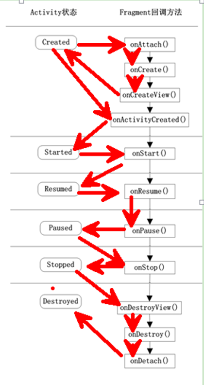
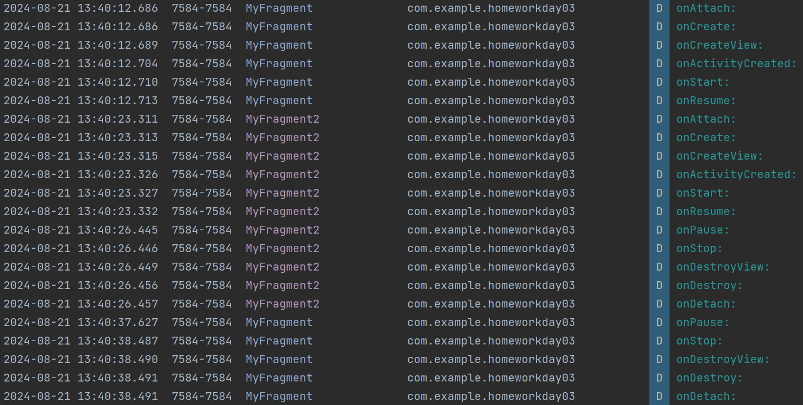

# Day03

## Fragment
[Android Studio Developer Fragment](https://developer.android.com/guide/fragments?hl=zh-cn)

### 为什么要有Fragment

- 手机的界面放在平板上可能会有被过分拉长，控件间距过大等情况。
针对屏幕尺寸的差距，Fragment能做到一个App同时适应手机和平板。

### Fragment的特点

Fragment是一种可以嵌入在Activity中的UI片段
其行为与Activity相似，有自己的布局，生命周期，接收自己的输入事件，并可以在运行的activity中添加或移除
一个fragment必须嵌入在一个activity中，同时fragment的生命周期受activity影响
本质上会产生一个FrameLayout，它加载的布局为其子布局

- **模块化** ：不必把所有的代码都写在一个activity中，而是把代码写在各自的fragment中
- **可重用** ：多个activity可以重用一个fragment
- **可适配** ：自适应布局

### Fragment生命周期

onAttach()：Fragment和Activity相关联时调用。可以通过该方法获取Activity引用，还可以通过getArguments()获取参数。

onCreate()：Fragment被创建时调用。

onCreateView()：创建，绘制Fragment的View组件时回调。

onActivityCreated()：当Activity完成onCreate()时调用。

onStart()：启动Fragment时回调。此时Fragment可见。

onResume()：当Fragment可见且可交互时调用。获取焦点时回调。

onPause()：当Fragment不可交互但可见时调用。失去焦点时回调。

onStop()：当Fragment不可见时调用。

onDestroyView()：当Fragment的UI从视图结构中移除时调用。未与Activity解除绑定。

onDestroy()：销毁Fragment时调用。

onDetach()：当Fragment和Activity解除关联时调用。



**生命周期日志**



### Fragment生命周期解析：

当一个fragment被创建的时候，需调用以下生命周期方法：onAttach(),  onCreate(),  onCreateView(),  onActivityCreated()

当这个fragment对用户可见的时候，需调用：onStart() ,onResume()

当这个fragment进入后台模式需调用：onPause(),onStop()

当这个fragment被销毁或者是持有它的Activity被销毁了，调用：onPause() ,onStop(), onDestroyView(),  onDestroy() onDetach()

### 静态注册和静态注册
代码：https://developer.android.com/guide/fragments/create?hl=zh-cn#java

**静态注册**

android:name 属性指定需实例化的 Fragment 的类名称。膨胀 Activity 的布局后，系统会实例化指定的 Fragment，
在新实例化的 Fragment 上调用 onInflate()，并创建 FragmentTransaction 以将 Fragment 添加到 FragmentManager 中。
```xml
<!-- res/layout/example_activity.xml -->
<androidx.fragment.app.FragmentContainerView
    xmlns:android="http://schemas.android.com/apk/res/android"
    android:id="@+id/fragment_container_view"
    android:layout_width="match_parent"
    android:layout_height="match_parent"
    android:name="com.example.ExampleFragment" />
```

**动态注册（以编程方式添加）**

与 XML 方法不同，android:name 属性不在此处的 FragmentContainerView 上使用，因此不会自动实例化特定 Fragment。
而是使用 FragmentTransaction 实例化 Fragment 并将其添加到 Activity 的布局。
```xml
<!-- res/layout/example_activity.xml -->
<androidx.fragment.app.FragmentContainerView
    xmlns:android="http://schemas.android.com/apk/res/android"
    android:id="@+id/fragment_container_view"
    android:layout_width="match_parent"
    android:layout_height="match_parent" />
```

当您的 Activity 正在运行时，您可以执行 Fragment 事务，如添加、移除或替换 Fragment。
在 FragmentActivity 中，您可以获取 FragmentManager 的实例，该实例可用于创建 FragmentTransaction。
然后，您可以使用 FragmentTransaction.add() 在 Activity 的 onCreate() 方法中实例化 Fragment，
传入布局内容器的 ViewGroup ID 和想要添加的 Fragment 类，然后提交该事务，如以下示例所示：

```java
public class ExampleActivity extends AppCompatActivity {
    public ExampleActivity() {
        super(R.layout.example_activity);
    }
    @Override
    protected void onCreate(Bundle savedInstanceState) {
        super.onCreate(savedInstanceState);
        if (savedInstanceState == null) {
            getSupportFragmentManager().beginTransaction()
                .setReorderingAllowed(true)
                .add(R.id.fragment_container_view, ExampleFragment.class, null)
                .commit();
        }
    }
}
```

请注意，在上面的示例中，只有在 savedInstanceState 为 null 时，才会创建 Fragment 事务。
这是为了确保仅添加该 Fragment 一次，即在首次创建 Activity 时添加。
当配置发生更改并且重新创建 Activity 时，savedInstanceState 不再为 null，并且不需要再次添加 Fragment，
因为 Fragment 会自动从 savedInstanceState 恢复。


可以通过调用 requireArguments() 从 Fragment 中检索参数 Bundle，并且可以使用适当的 Bundle getter 方法检索每个参数。
```java
class ExampleFragment extends Fragment {
    public ExampleFragment() {
        super(R.layout.example_fragment);
    }

    @Override
    public void onViewCreated(@NonNull View view, Bundle savedInstanceState) {
        int someInt = requireArguments().getInt("some_int");
        // ...
    }
}
```

### Fragment 回退栈
可以用addToBackStack将事务添加到回退栈

### Fragment与Activity通信

实现在FragmentTongxinActivity中

### Fragment动画

在ExampleActivity的btn_replace的click中有所体现

### Homework

实现在HomeworkActivity中。

