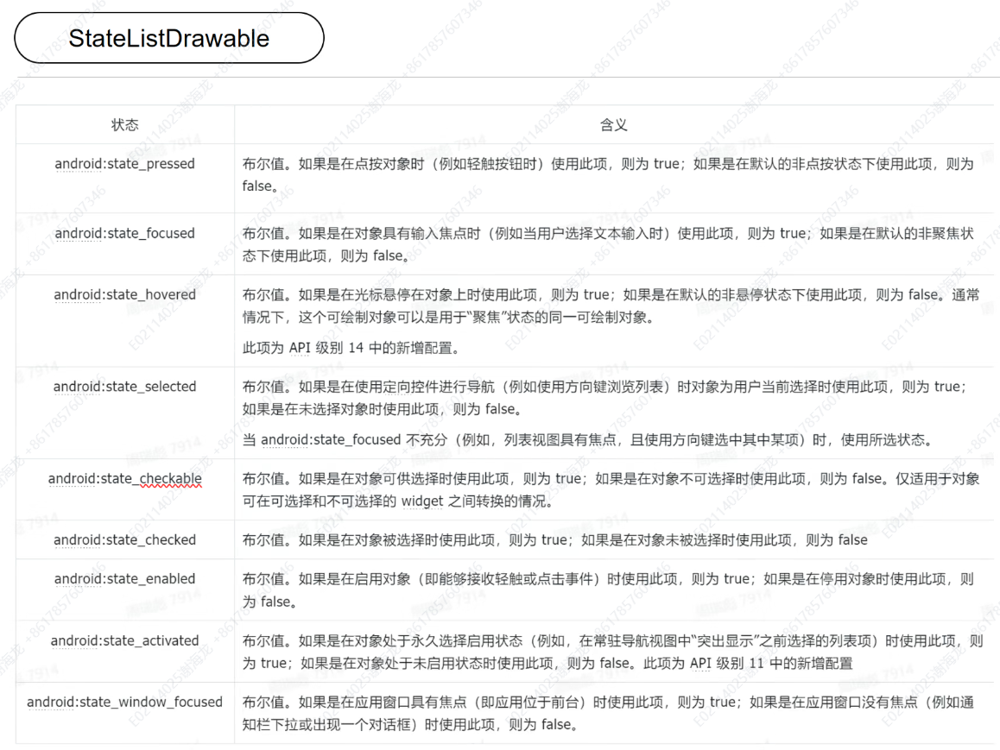
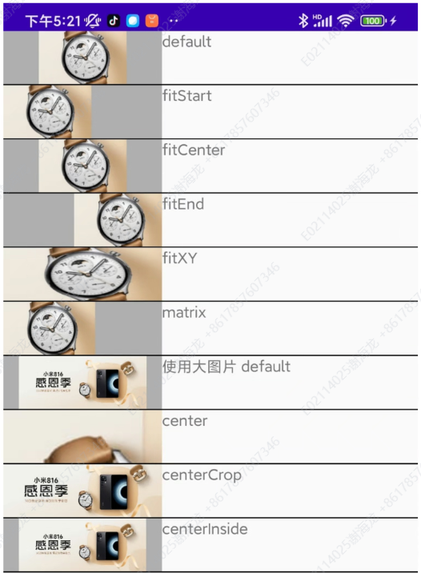
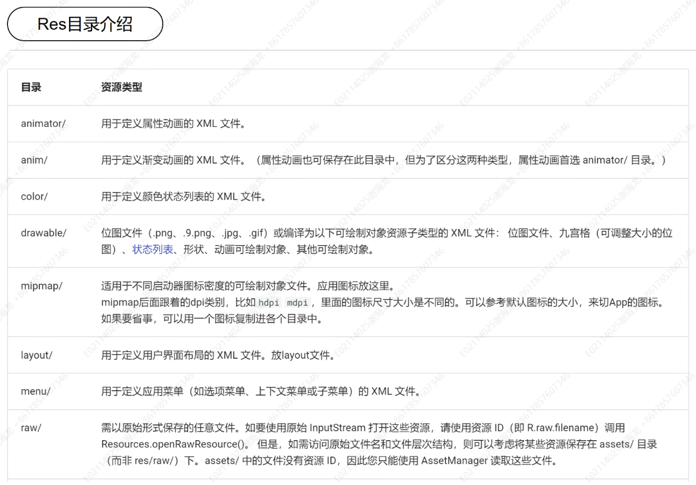
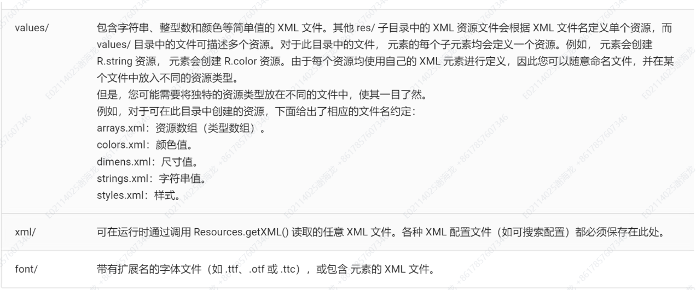

# DAY04(Android UI）

## Android 控件常用属性

### 通用属性

1. **`android:id`**
    - 定义控件的唯一标识符。
    - 示例：`android:id="@+id/myButton"`

2. **`android:layout_width`**
    - 设置控件的宽度。
    - 常见值：`wrap_content`, `match_parent`, `具体值（如100dp）`
    - 示例：`android:layout_width="wrap_content"`

3. **`android:layout_height`**
    - 设置控件的高度。
    - 常见值：`wrap_content`, `match_parent`, `具体值（如100dp）`
    - 示例：`android:layout_height="wrap_content"`

4. **`android:layout_margin`**
    - 设置控件与其父布局边缘之间的距离。
    - 可以分别设置：`android:layout_marginTop`，`android:layout_marginBottom`，`android:layout_marginLeft`，`android:layout_marginRight`
    - 示例：`android:layout_margin="16dp"`

5. **`android:padding`**
    - 设置控件内容与控件边缘之间的内间距。
    - 可以分别设置：`android:paddingTop`，`android:paddingBottom`，`android:paddingLeft`，`android:paddingRight`
    - 示例：`android:padding="8dp"`

6. **`android:background`**
    - 设置控件的背景颜色或图片。
    - 示例：`android:background="#FF0000"` 或 `android:background="@drawable/background_image"`

7. **`android:gravity`**
    - 控制控件内容在控件内的对齐方式。
    - 常见值：`center`, `left`, `right`, `top`, `bottom`
    - 示例：`android:gravity="center"`

8. **`android:visibility`**
    - 控制控件的可见性。
    - 常见值：`visible`, `invisible`, `gone`
    - 示例：`android:visibility="gone"`

### 特定控件的常用属性

#### TextView 和其子类（包括 Button, EditText 等）

1. **`android:text`**
    - 设置控件显示的文本内容。
    - 示例：`android:text="Hello World"`

2. **`android:textSize`**
    - 设置文本的字体大小。
    - 示例：`android:textSize="16sp"`

3. **`android:textColor`**
    - 设置文本的颜色。
    - 示例：`android:textColor="#000000"`

4. **`android:textStyle`**
    - 设置文本的样式。
    - 常见值：`normal`, `bold`, `italic`
    - 示例：`android:textStyle="bold"`

5. **`android:hint`**
    - 设置提示文本，通常用于 `EditText`。
    - 示例：`android:hint="Enter your name"`

6. **`android:inputType`**
    - 设置输入类型，通常用于 `EditText`。
    - 常见值：`text`, `number`, `phone`, `textPassword`
    - 示例：`android:inputType="textPassword"`

#### ImageView

1. **`android:src`**
    - 设置要显示的图片资源。
    - 示例：`android:src="@drawable/my_image"`

2. **`android:scaleType`**
    - 设置图片的缩放类型。
    - 常见值：`center`, `centerCrop`, `centerInside`, `fitCenter`, `fitXY`
    - 示例：`android:scaleType="centerCrop"`

#### 布局相关的属性

1. **`android:layout_gravity`**
    - 设置控件在父布局中的对齐方式（用于容器控件内的子控件）。
    - 示例：`android:layout_gravity="center"`

2. **`android:layout_weight`**
    - 设置控件在布局中占据的比重（通常用于 `LinearLayout`）。
    - 示例：`android:layout_weight="1"`

3. **`android:layout_alignParentTop`**
    - 设置控件对齐到父布局的顶部（通常用于 `RelativeLayout`）。
    - 示例：`android:layout_alignParentTop="true"`


### Button

- **`setOnClickListener(OnClickListener listener)`**
  设置按钮点击事件的监听器，用于处理按钮被点击时的动作。
- **`setOnLongClickListener(OnLongClickListener listener)`**
  设置按钮长按事件的监听器，用于处理按钮被长按时的动作。
- **`setOnTouchListener(OnTouchListener listener)`**
  监听触摸事件，用于处理用户在按钮上执行的触摸动作（如按下、移动、抬起）。
- **`setOnFocusChangeListener(OnFocusChangeListener listener)`**
  监听焦点变化事件，用于处理按钮获取或失去焦点时的操作。
- **`setOnKeyListener(OnKeyListener listener)`**
  监听按键事件，用于处理用户按下键盘上的按键时的操作。
- **`setOnHoverListener(OnHoverListener listener)`**
  监听悬停事件，用于处理用户在按钮上悬停（通常用于具有鼠标的设备上）。
- **`setOnDragListener(OnDragListener listener)`**
  监听拖动事件，用于处理用户在按钮上拖动某项内容的操作。
- **`setOnCreateContextMenuListener(OnCreateContextMenuListener listener)`**
  监听上下文菜单创建事件，用于处理用户长按按钮时弹出上下文菜单的操作。

#### Button常用状态


### ImageView



## [Span](https://developer.android.com/develop/ui/views/text-and-emoji/spans?hl=zh-cn)

### Span选择

| 类                      |  可变文本  | 可变标记  | 数据结构 |
|------------------------|:------:|:-----:|------|
| SpannedString          |   否    |   否   | 线性数组 |
| SpannableString        |   否    |   是   | 线性数组 |
| SpannableStringBuilder |   是    |   是   | 区间树  |

- 如果您不准备在创建后修改文本或标记，请使用 SpannedString。
- 如果您需要将少量 Span 附加到单个文本对象，并且 文本本身是只读的，请使用 SpannableString。
- 如果您需要在创建后修改文本，并且需要将 span 附加到 文本，使用 SpannableStringBuilder。
- 如果您需要将大量 span 附加到文本对象，无论其 请使用 SpannableStringBuilder。


代码示例：
```java
SpannableStringBuilder spannable = new SpannableStringBuilder("Text is spantastic!");
spannable.setSpan(
    new ForegroundColorSpan(Color.RED),
    8, // start
    12, // end
    Spannable.SPAN_EXCLUSIVE_INCLUSIVE
);
```

代码示例：
```java
SpannableStringBuilder spannable = new SpannableStringBuilder("Text is spantastic!");
spannable.setSpan(
    new ForegroundColorSpan(Color.RED),
    8, // start
    12, // end
    Spannable.SPAN_EXCLUSIVE_INCLUSIVE
);
spannable.insert(12, "(& fon)");
```


## Res目录介绍





## 演示视频(位于video文件夹下)
<video controls width="600">
  <source src="video/Day04-演示视频.mp4" type="video/mp4">
  Your browser does not support the video tag.
</video>
