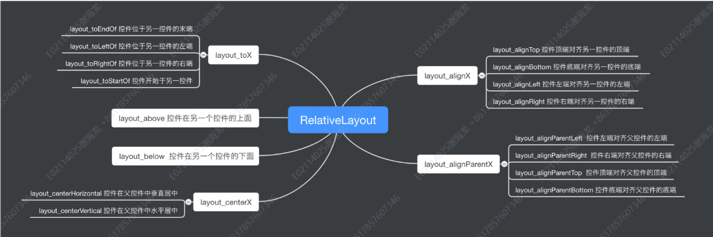

# Day05

## Android布局与优化

### 主要共有属性

这些属性是大多数布局控件共有的，它们控制布局的基本行为。

- `android:id`: 为布局定义唯一的标识符。
- `android:layout_width`: 定义布局的宽度。常用值包括 `match_parent`、`wrap_content` 和具体尺寸（如 `200dp`）。
- `android:layout_height`: 定义布局的高度。常用值与 `android:layout_width` 相同。
- `android:padding`: 定义布局内部内容的内边距。
- `android:background`: 设置布局的背景颜色或图像。
- `android:visibility`: 设置布局的可见性状态。可选值为 `visible`、`invisible` 和 `gone`。
- `android:layout_margin`: 定义布局与其父布局边缘的外边距。

### 主要特有属性

#### **LinearLayout**
- `android:orientation`: 设置布局的方向，可以是 `horizontal` 或 `vertical`。
- `android:gravity`: 控制子控件在布局中的对齐方式。
- `android:weightSum`: 定义布局权重的总和，用于分配空间。
- `layout_weight` : 定义控件的权重。

#### **RelativeLayout**
- `android:layout_alignParentTop`: 如果设置为 `true`，子控件将对齐到父布局的顶部。
- `android:layout_centerInParent`: 如果设置为 `true`，子控件将居中对齐到父布局。
- `android:layout_toRightOf`: 子控件将位于指定控件的右侧。

#### **FrameLayout**
- `android:foreground`: 设置布局的前景图像。
- `android:measureAllChildren`: 决定是否测量所有子控件的大小，即使它们是 `GONE` 状态。

#### **ConstraintLayout**
- `app:layout_constraintTop_toTopOf`: 子控件的顶部对齐到另一个控件的顶部。
- `app:layout_constraintBottom_toBottomOf`: 子控件的底部对齐到另一个控件的底部。
- `app:layout_constraintHorizontal_bias`: 设置子控件在水平方向上的偏移量，范围为 `0.0` 到 `1.0`。

#### **TableLayout**
- `android:stretchColumns`: 指定应被拉伸以填充剩余空间的列。
- `android:shrinkColumns`: 指定在需要时可以收缩的列。
- `android:collapseColumns`: 指定应折叠的列。

#### **GridLayout**
- `android:rowCount`: 设置行的数量。
- `android:columnCount`: 设置列的数量。
- `android:orientation`: 设置网格的排列方向，可以是 `horizontal` 或 `vertical`。

### Android主要布局特点与使用场景

#### **LinearLayout**
- **特点**:
    - 按照指定的方向（水平或垂直）依次排列子控件。
    - 支持权重（`weight`）分配，使多个控件按比例分享剩余空间。
    - 简单易用，布局顺序即为显示顺序。

- **主要使用场景**:
    - 需要简单地将控件垂直或水平排列的场景。
    - 需要按比例分配控件大小的场景，如两个按钮按1:2的比例分配空间。

#### **RelativeLayout**
- **特点**:
    - 允许子控件相对于父布局或其他控件进行定位。
    - 通过灵活的属性配置，可以实现复杂的布局排列。
    - 可以减少布局嵌套的深度，从而提高性能。

- **主要使用场景**:
    - 需要复杂的控件排列和相互依赖的布局。
    - 需要对控件进行精确定位，如将一个按钮定位在另一个控件的右侧或下方。

#### **FrameLayout**
- **特点**:
    - 所有子控件堆叠在一起，默认情况下显示最后添加的控件。
    - 简单而高效，适用于简单布局需求。
    - 通过调整子控件的`layout_gravity`属性，可以控制其在父布局中的位置。

- **主要使用场景**:
    - 需要在同一位置叠放多个控件的场景，如背景图像上显示文字。
    - 需要动态切换显示内容的场景，如Fragment切换。

#### **ConstraintLayout**
- **特点**:
    - 提供了更强大的布局功能，子控件之间可以建立复杂的约束关系。
    - 通过约束和偏移实现复杂的UI布局，而不需要嵌套多个布局。
    - 与Android Studio的可视化编辑器深度集成，易于设计复杂布局。

- **主要使用场景**:
    - 需要创建复杂布局，同时希望保持较高性能的场景。
    - 需要在不同屏幕尺寸和方向上自动调整布局的场景。

#### **TableLayout**
- **特点**:
    - 按行和列的方式排列控件，类似于HTML中的表格布局。
    - 可以指定某些列的宽度可变或固定。
    - 每行的高度由行中最高的控件决定。

- **主要使用场景**:
    - 需要将数据以表格形式展示的场景，如日历视图、计算器布局。
    - 需要对齐控件并在网格中排列的场景。

#### **GridLayout**
- **特点**:
    - 将布局分为多个行和列，子控件按网格排列。
    - 比`TableLayout`更灵活，支持单个控件跨多行或多列。
    - 可以通过设置行列的比例来控制布局的大小和对齐方式。

- **主要使用场景**:
    - 需要创建网格状布局，如照片墙、图标排列。
    - 需要在网格中控制每个控件的大小和位置的场景。

### RelativeLayout

### TableLayout

### ConstraintLayout

## Homework With Gpu Overflow

